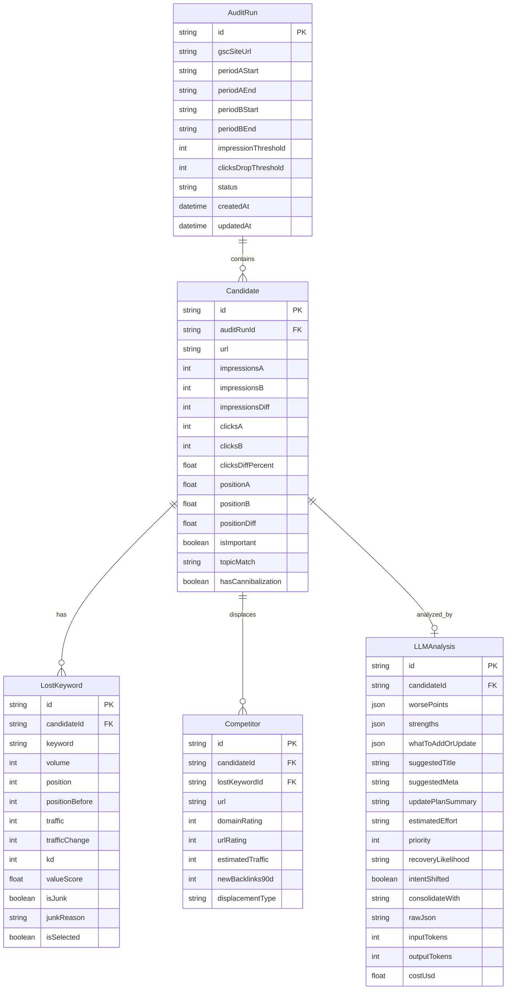

# SEO Content Audit & Recovery Tool

## Overview

A Next.js web application that helps an SEO analyst identify declining blog posts and generate actionable update recommendations. The tool automates GSC data collection and LLM-powered analysis while guiding the analyst through manual Ahrefs data collection steps.

**Objective:** Systematically identify blog posts losing organic traffic, diagnose why they're declining, and produce prioritized update recommendations to recover rankings, impressions, and clicks.

---

## Part 1: SEO Process Review & Improvements

> Before building the tool, the underlying SEO workflow must be sound. The original spec has a solid foundation but has several gaps that could lead to wasted effort or missed recovery opportunities.

### What the Original Spec Gets Right

- **Starting with GSC data** — first-party, reliable, no third-party dependency
- **Period comparison** — standard technique for identifying drops
- **Topic filtering** — focuses effort on business-relevant content
- **Value Score formula** — reasonable prioritization combining volume, traffic loss, and position
- **Competitor displacement analysis** — helps diagnose recoverable vs. unrecoverable drops
- **LLM-powered gap analysis** — scalable approach to content comparison

### Critical Process Gaps (Must Fix)

#### 1. No Cannibalization Detection

Before assuming a page lost traffic to external competitors, check if another page on YOUR OWN site is cannibalizing it. This is one of the most common causes of traffic drops and the spec completely ignores it.

**Fix:** After Stage 1, add a cannibalization check:
- Query GSC with `dimensions: ["page", "query"]` for the lost keywords
- If multiple pages from the same site rank for the same query, flag as "Possible cannibalization"
- Recovery strategy for cannibalization (consolidate/redirect/deoptimize) is completely different from competitive displacement

#### 2. Missing Position & CTR Data from GSC

The spec only uses impressions and clicks, but GSC also returns **average position** and **CTR**. These tell critical diagnostic stories:

| Scenario | Diagnosis | Action |
|---|---|---|
| Position stable, CTR dropped | SERP feature stealing clicks (AI Overviews, featured snippets) | Optimize for SERP features, add structured data |
| Position dropped, impressions stable | Ranking lower but still appearing | Content/authority gap — update content |
| Position dropped, impressions dropped | Significant ranking loss | Deep analysis needed — may be unrecoverable |
| Impressions up, clicks down | More visibility but less engagement | Title/meta description needs improvement |

**Fix:** Include `position` and `ctr` in GSC analysis. Calculate position_diff and ctr_diff alongside impressions_diff and clicks_diff. Display these in the output.

#### 3. Comparison Window Too Short

28 days vs. previous 28 days only catches sudden drops. Many SEO declines are gradual — losing 100-200 impressions/month over 3-6 months. By the time a 28-day comparison flags it, you've already lost significant traffic.

**Fix:** Support multiple comparison modes:
- **Quick check** (default): Last 28 days vs. previous 28 days — catches recent drops
- **Trend analysis**: Last 28 days vs. same 28 days last year — catches seasonal and long-term declines
- **Quarterly**: Last 90 days vs. previous 90 days — catches gradual declines

Let the analyst select which comparison(s) to run. The "trend analysis" (YoY) is often more actionable for content updates.

#### 4. No Search Intent Shift Detection

Google may now interpret a query differently than before. For example, "headless cms" might have shifted from informational (blog posts) to commercial (product pages/comparisons). If intent shifted, no amount of content updating will recover rankings for that query — you need a different type of page.

**Fix:** In the LLM analysis prompt, explicitly ask:
- "Has the search intent for these keywords shifted? Check if the current top 10 results are the same type (informational, commercial, navigational, transactional) as our article."
- If intent shifted, recommend creating a new page matching the new intent rather than updating the old one.

#### 5. Displacement Classification Incomplete

The spec's 4 categories (High authority, Content update, New article, Other) miss important displacement types:

| Missing Category | How to Detect | Recovery Implication |
|---|---|---|
| **SERP feature takeover** | Featured snippet, AI Overview, or knowledge panel now occupies the space | Optimize for featured snippets, add FAQ schema |
| **Site-wide authority drop** | Multiple pages across the site dropped simultaneously | Backlink campaign needed, not content update |
| **Search intent shift** | Top 10 results changed type (informational → commercial) | Create new page matching new intent |
| **Seasonal decline** | Same drop pattern appears YoY | Not a problem — wait for season |

**Fix:** Expand the classification system. The LLM analysis can help identify these if given the right data and prompt.

#### 6. No Consolidation Recommendation

Sometimes the best strategy isn't updating one declining page but **merging multiple declining pages** into one comprehensive resource and redirecting the others. The spec never considers this.

**Fix:** After identifying candidate pages, check for topic overlap:
- If 3+ declining pages cover similar subtopics, recommend consolidation
- Include a "Consolidate with" column in the output

#### 7. LLM Prompt Flaw: "Fetch Content" Is Impossible

The spec's prompt template instructs the LLM to "Fetch the full current content of my article and all competitor articles." Claude API cannot browse the web. The app must fetch article content itself and include it in the prompt.

**Fix:** The app must:
1. Fetch our article's HTML via server-side HTTP request
2. Extract main content (strip nav, footer, ads, scripts)
3. Fetch competitor article HTML similarly
4. Include extracted text in the LLM prompt context

This is a significant engineering task but is essential. Without it, the LLM analysis is impossible or fabricated.

### Improved Process Flow

```
Stage 1: GSC Data Collection & Filtering (AUTOMATED)
  1.1 Fetch GSC data for both periods (impressions, clicks, position, CTR)
  1.2 Remove fragment URLs
  1.3 Calculate all drop metrics (impressions_diff, clicks_diff, position_diff, ctr_diff)
  1.4 Filter by configurable thresholds
  1.5 Topic filter for business relevance
  1.6 Cannibalization pre-check (same-site keyword overlap)

Stage 2: Ahrefs Data Import (MANUAL CSV + AUTOMATED PARSING)
  2.1 App displays exact Ahrefs export instructions per candidate URL
  2.2 User uploads CSV exports (Organic Keywords, Backlinks)
  2.3 App parses CSVs, maps to candidates, validates data
  2.4 App calculates Value Scores, selects top keywords
  2.5 App applies junk keyword filters (automated rules + user review)

Stage 3: Content & Competitor Analysis (AUTOMATED)
  3.1 App fetches our article content (HTML → extracted text)
  3.2 App fetches competitor article content (from Ahrefs SERP data)
  3.3 App classifies displacement reasons from Ahrefs metrics
  3.4 App constructs enriched LLM prompts with actual content
  3.5 LLM performs content gap analysis + intent shift detection
  3.6 LLM response parsed and validated via Zod schema

Stage 4: Output & Recommendations (AUTOMATED)
  4.1 Generate multi-tab Excel (.xlsx) with all data
  4.2 Include recovery likelihood estimate per page
  4.3 Flag consolidation opportunities
  4.4 Include cost summary for LLM usage
```

---

## Part 2: Automation Classification

### Fully Automated (No Human Intervention)

| Component | Details |
|---|---|
| GSC data fetch | OAuth → API call → paginated results for both periods |
| URL cleanup | Filter out fragment URLs |
| Drop metric calculation | impressions_diff, clicks_diff_percent, position_diff, ctr_diff |
| Threshold filtering | Configurable cutoffs applied in code |
| Topic regex matching | Regex applied to URL path |
| Cannibalization detection | GSC query with `["page", "query"]` dimensions, cross-reference |
| Value Score calculation | `(Volume × 0.4) + (Traffic_loss × 0.5) + (Position_before × 0.1) – (KD × 0.05)` |
| Keyword junk filtering (rule-based) | Volume < 100, KD > 65, brand exclusion list |
| Article content fetching | HTTP fetch → HTML → text extraction |
| LLM prompt construction | Template with real data injected |
| LLM API calls | Claude Sonnet with retry logic and cost tracking |
| JSON response parsing | Zod schema validation |
| Excel report generation | ExcelJS multi-tab output |
| Displacement classification (partial) | Rules-based on DR, UR, traffic, backlink metrics |

### Semi-Automated (App Guides, Human Provides Data)

| Component | What the App Does | What the Human Does |
|---|---|---|
| Ahrefs data collection | Shows exact instructions: which report, which filters, which export button | Goes to Ahrefs UI, follows instructions, downloads CSVs |
| CSV upload & mapping | Parses CSVs, validates columns, maps to candidates, shows preview | Reviews mapping, fixes mismatches, confirms |
| Candidate review | Presents filtered list with metrics | Reviews, adds/removes pages, adjusts "Important" flags |
| Keyword review | Shows junk-filtered keywords with scores | Overrides filters for borderline keywords, confirms top picks |
| Competitor data (from Ahrefs) | Lists which competitor URLs need data | Exports SERP/competitor data from Ahrefs |
| Displacement classification (subjective) | Suggests classification based on metrics | Confirms or overrides for ambiguous cases |

### Fully Manual (Outside the App)

| Component | Why It Can't Be Automated |
|---|---|
| Ahrefs UI navigation | No API access; Ahrefs requires authenticated browser session |
| "Broad/non-intent" keyword judgment | Subjective, context-dependent (the app can flag likely candidates but human confirms) |
| "Commercial vs. informational" intent matching | Requires understanding article purpose vs. keyword intent |
| Final update priority decisions | Business judgment — which pages matter most strategically |
| Actually updating the content | Writing/editing blog posts is outside scope |

---

## Part 3: Technical Implementation Plan

### Tech Stack

| Layer | Choice | Rationale |
|---|---|---|
| Framework | Next.js 16 (App Router) | Latest stable; Turbopack default, `proxy.ts`, Cache Components |
| Language | TypeScript | Type safety, better DX |
| Auth | NextAuth.js v5 (Auth.js) + Google OAuth | Handles GSC OAuth tokens and refresh |
| GSC Client | `googleapis` npm package | Official Google client, handles pagination |
| CSV Parsing | `papaparse` | Browser-native, handles UTF-16/BOM, auto-detects delimiters |
| Excel Output | `ExcelJS` | Multi-tab, MIT license, streaming write |
| LLM | `@anthropic-ai/sdk` | Official Anthropic SDK with built-in retries |
| Validation | Zod | Schema validation for LLM responses and CSV mapping |
| Concurrency | `p-limit` | Control parallel LLM calls (max 3) |
| Content Extraction | `cheerio` or `@mozilla/readability` + `jsdom` | Extract article text from HTML |
| Styling | Tailwind CSS | Fast UI development |

### Project Structure

```
marketing-tools/
├── app/
│   ├── layout.tsx                          # Root layout with providers
│   ├── page.tsx                            # Landing page / dashboard
│   ├── audit/
│   │   ├── page.tsx                        # Main audit wizard container
│   │   └── _components/
│   │       ├── StepGSCConnect.tsx          # Step 1: OAuth + site selection
│   │       ├── StepConfigurePeriods.tsx    # Step 2: Configure + review GSC candidates (merged)
│   │       ├── StepUploadAhrefs.tsx        # Step 3: CSV upload + parsing
│   │       ├── StepKeywordReview.tsx       # Step 4: Review scored keywords
│   │       ├── StepProcessing.tsx          # Step 5: LLM processing + progress
│   │       └── StepResults.tsx             # Step 6: Download report
│   └── api/
│       ├── auth/[...nextauth]/route.ts     # NextAuth Google OAuth
│       ├── gsc/
│       │   ├── sites/route.ts              # List user's GSC properties
│       │   └── query/route.ts              # Execute GSC queries
│       ├── upload/route.ts                 # Handle CSV file uploads
│       ├── audit/
│       │   ├── start/route.ts              # Kick off pipeline
│       │   └── status/[jobId]/route.ts     # SSE progress stream
│       └── download/[jobId]/route.ts       # Download Excel result
├── lib/
│   ├── gsc/
│   │   ├── client.ts                       # GSC API client + pagination
│   │   ├── types.ts                        # GSC request/response types
│   │   └── comparison.ts                   # Period comparison logic
│   ├── ahrefs/
│   │   ├── parse-csv.ts                    # Parse Ahrefs CSV with papaparse + file type detection
│   │   ├── transform-keywords.ts           # Map CSV rows → LostKeyword[]
│   │   ├── transform-backlinks.ts          # Map CSV rows → ParsedBacklink[]
│   │   ├── match-urls.ts                   # URL normalization + keyword-to-page slug matching
│   │   └── scoring.ts                      # Value score calculation + junk detection
│   ├── analysis/
│   │   ├── filters.ts                      # Drop filters, topic filter, junk filter
│   │   ├── scoring.ts                      # Value Score calculation
│   │   ├── cannibalization.ts              # Same-site keyword overlap detection
│   │   └── displacement.ts                 # Competitor displacement classification
│   ├── content/
│   │   └── extractor.ts                    # Fetch URL → extract article text
│   ├── llm/
│   │   ├── client.ts                       # Anthropic SDK wrapper
│   │   ├── prompts.ts                      # Prompt templates
│   │   ├── schemas.ts                      # Zod schemas for LLM responses
│   │   └── cost-tracker.ts                 # Token usage and cost tracking
│   ├── output/
│   │   └── excel-generator.ts              # ExcelJS multi-tab report
│   ├── jobs/
│   │   └── job-store.ts                    # In-memory job queue + status
│   └── pipeline/
│       └── audit-pipeline.ts               # Orchestrates full pipeline
├── config/
│   ├── brand-exclusions.json               # Keywords to exclude (brand/competitor names)
│   └── topic-patterns.json                 # Configurable topic regex patterns
├── docs/
│   ├── raw-spec.md                         # Original specification
│   └── plans/                              # This plan
├── next.config.ts
├── package.json
└── tsconfig.json
```

### UI Design Principle: Descriptive & Educational

Every screen in the wizard must be **self-documenting**. The user should never wonder "what does this do?" or "why is this step needed?" Each step includes:

- **Step title + subtitle** explaining what happens here and why
- **Contextual help text** on every form field, threshold slider, and data table explaining what the value means and how it affects results
- **"Why this matters" callouts** for key metrics (e.g., next to impressions_diff, explain that a large negative means fewer people are seeing your page in search results)
- **Ahrefs instruction panels** with step-by-step screenshots/descriptions: which report to open, which filters to set, which button to click for export
- **Data interpretation guidance** in results tables (e.g., "Pages with clicks_diff < -30% are losing significant organic traffic and are strong update candidates")
- **Tooltips** on column headers explaining each metric
- **Empty states** with helpful messaging (e.g., "No declining pages found. This is good news! Your content is holding steady. Try adjusting thresholds or date ranges to cast a wider net.")

### Implementation Phases

> **Approach:** Start with a complete static mockup using mocked data to validate the UX flow end-to-end. Then progressively replace mocked data with real API integrations, one stage at a time.

#### Phase 1: Static Mockup (Full UX Walkthrough with Mocked Data) ✅ COMPLETE

Build the complete wizard UI with realistic mocked data so we can walk through every step and validate the flow before writing any API integration code.

**Deliverables:**
- [x] Next.js 16 project setup with TypeScript, Tailwind CSS (`app/` directory structure)
- [x] Root layout with navigation, branding, step indicator
- [x] Complete wizard with all 6 steps, navigable with Next/Back buttons (merged Configure + Review into single step)
- [x] All steps use mocked data from `lib/mock-data.ts` (realistic sample data)
- [x] **Step 1: GSC Connect** — mock OAuth button, site property dropdown (mocked list)
- [x] **Step 2: Configure & Review** — date range pickers, threshold sliders, comparison mode selector, blog URL pattern input, inline results table with sortable columns, page selection
- [x] **Step 3: Upload Ahrefs CSVs** — drag-and-drop upload zone, file preview after upload, mock data fallback
- [x] **Step 4: Keyword Review** — scored keyword table, Value Score breakdown, junk-filtered keywords with reason, user can toggle on/off
- [x] **Step 5: Processing** — simulated progress bar with step descriptions, per-article progress
- [x] **Step 6: Results & Download** — expandable result cards with LLM details, mock Excel download button, summary stats
- [x] Every step has contextual help text, tooltips on column headers, and InfoCallout explanations
- [x] Responsive layout (works on desktop)

**Note:** Original plan had 7 steps; Step 2 (Configure) and Step 3 (Review Pages) were merged into a single "Configure & Review" step for better UX (user can tweak settings and re-fetch without navigating). Wizard is now 6 steps.

#### Phase 2: Connect GSC API (Make Stage 1 Dynamic) ✅ COMPLETE

Replace mocked GSC data with real API integration.

**Deliverables:**
- [x] NextAuth.js Google OAuth with `webmasters.readonly` scope (`app/api/auth/[...nextauth]/route.ts`)
- [x] GSC API client with pagination (`lib/gsc/client.ts`)
- [x] Period comparison logic — two API calls in parallel, merge, compute diffs (`lib/gsc/comparison.ts`)
- [x] All filters: URL cleanup (#fragments), drop thresholds, topic regex, impressions minimum (`lib/analysis/filters.ts`)
- [x] Position and CTR diff calculations alongside impressions and clicks
- [x] Step 1 now uses real OAuth flow
- [x] Step 2 submits real GSC queries and shows results inline
- [x] Falls back to mock data if GSC not connected
- [ ] Basic Excel output with "Raw GSC Data" and "Candidates" tabs — **deferred to Phase 4/5**
- [ ] Download endpoint for generated Excel file — **deferred to Phase 4/5**

**Acceptance Criteria:**
- [x] User can OAuth into GSC, select a property from their real account
- [x] App fetches real data, computes all diffs, applies all filters
- [x] User sees real candidate list with all metrics (impressions, clicks, position, CTR diffs)
- [ ] User can download Excel with real raw + filtered data — **deferred**
- [x] Handles pagination for sites with 25K+ blog pages
- [x] Loading states while GSC data fetches
- [x] Error handling for OAuth failures, API errors, empty results

#### Phase 3: Ahrefs CSV Import + Keyword Scoring (Make Stage 2 Dynamic) ✅ COMPLETE

Replace mocked Ahrefs data with real CSV upload and parsing.

**Deliverables:**
- [x] Client-side CSV parsing with `papaparse` — handles UTF-16LE/BOM, tab-delimited, auto-detects format (`lib/ahrefs/parse-csv.ts`)
- [x] File type auto-detection from column headers (organic-keywords vs backlinks vs unknown)
- [x] URL normalization + keyword-to-page slug matching heuristic (`lib/ahrefs/match-urls.ts`)
- [x] Value Score calculation: `(Volume × 0.4) + (|TrafficLoss| × 0.5) + (PosBefore × 0.1) − (KD × 0.05)` (`lib/ahrefs/scoring.ts`)
- [x] Keyword junk filters: volume < 100, KD > 65 (`lib/ahrefs/scoring.ts`)
- [x] Step 3 now handles real drag-and-drop file uploads with per-file summary stats
- [x] Step 4 receives real keyword data via props, KD column conditional (hidden when not available)
- [x] Ahrefs export instructions updated to match actual export workflow
- [ ] Excel output extended with "Lost Keywords Detail" tab — **deferred to Phase 5**

**Key design decisions (differ from original plan):**
- **Client-side parsing** instead of server-side upload API — Ahrefs CSVs are local files, no secrets, papaparse handles encoding natively in the browser. No `app/api/upload/route.ts` needed.
- **2 file types** instead of 3 — "Competitor SERP" is not a standard Ahrefs export. Simplified to Organic Keywords + Backlinks.
- **KD is optional** — real Ahrefs domain-level organic keywords export doesn't include KD. `LostKeyword.kd` is now `kd?: number`.
- **Keyword-to-page matching via slug heuristic** — domain-level export has no URL column, so we match by checking if keyword tokens appear in candidate URL slugs (>= 40% overlap).

**Acceptance Criteria:**
- [x] User can upload real Ahrefs CSVs with drag-and-drop
- [x] App auto-detects file type from column headers
- [x] App maps keywords to GSC candidates via slug matching, shows matched/unmatched counts
- [x] Unmatched keywords shown as "Unassigned" with filter option in Step 4
- [x] Value Scores calculated, keywords auto-sorted by score
- [x] User can override keyword selection (check/uncheck in Step 4)
- [x] Handles encoding issues (UTF-16LE BOM, UTF-8, tab-delimited)
- [x] Validates CSV format before parsing (rejects non-CSV, unknown formats, empty files)

#### Phase 4: Content Fetching + LLM Analysis (Make Stage 3 Dynamic) ⬜ TODO — NEXT UP

Replace mocked LLM results with real content fetching and Claude API integration.

**Deliverables:**
- [ ] Content extractor: fetch URL → parse HTML → extract article body (`lib/content/extractor.ts`)
- [ ] Use `@mozilla/readability` + `jsdom` for reliable article extraction
- [ ] LLM prompt templates with actual content injection (`lib/llm/prompts.ts`)
- [ ] Updated prompt that does NOT ask LLM to fetch URLs (content is pre-fetched)
- [ ] Add intent shift detection to LLM prompt
- [ ] Zod schema for LLM response validation (`lib/llm/schemas.ts`)
- [ ] Retry logic: strip markdown fences, re-extract JSON, retry on parse failure
- [ ] Cost tracker with per-call and cumulative cost display (`lib/llm/cost-tracker.ts`)
- [ ] Cost estimation step before processing ("This will cost ~$X for N articles. Proceed?")
- [ ] API route for running analysis (`app/api/audit/start/route.ts`)
- [ ] SSE progress streaming (`app/api/audit/status/[jobId]/route.ts`)
- [ ] Concurrency control: max 3 parallel LLM calls via `p-limit`
- [ ] Wire Step 5 (Processing) to real API — replace mock progress with SSE updates
- [ ] Wire Step 6 (Results) to real `LLMAnalysis[]` data via props — remove mock imports
- [ ] Excel output with "LLM Raw JSON" tab and full "Update Queue" main tab

**LLM Prompt Improvements Over Original Spec:**
```
Key changes to the prompt template:
1. REMOVE: "Fetch the full current content" instruction
2. ADD: Pre-fetched article content and competitor content in the prompt
3. ADD: "Has search intent shifted for these keywords?"
4. ADD: "Is consolidation with other pages recommended?"
5. ADD: "What is the recovery likelihood (High/Medium/Low)?"
6. KEEP: JSON output format with Zod validation
```

**Acceptance Criteria:**
- [ ] App fetches and extracts text from our articles and competitor articles
- [ ] Handles fetch failures gracefully (timeout, 403, JS-rendered pages flagged as "partial extraction")
- [ ] LLM analysis runs with real-time progress indication
- [ ] Cost shown before (estimate) and after (actual) processing
- [ ] Invalid JSON responses retried (up to 3 attempts)
- [ ] All LLM columns populated in Excel output
- [ ] Budget cap stops processing if exceeded

#### Phase 5: Advanced Features & Polish ⬜ TODO

**Deliverables:**
- [ ] Cannibalization detection via GSC `["page", "query"]` query (`lib/analysis/cannibalization.ts`)
- [ ] Displacement classification with expanded categories (`lib/analysis/displacement.ts`)
- [ ] Consolidation recommendation (detect topic overlap between candidates)
- [x] Multiple comparison modes (28d, 90d, YoY) — already in Step 2 UI
- [ ] Configurable settings UI: thresholds, topic patterns, brand exclusions, LLM model
- [ ] Pipeline state persistence — save/resume interrupted audits (JSON files on disk)
- [ ] Export report download with formatted styling (conditional formatting, frozen headers)
- [ ] "Competitor SERP Changes" tab in Excel output
- [ ] Audit history — list of previous runs with quick re-run option

**Acceptance Criteria:**
- [ ] Cannibalization flagged in output when detected
- [ ] User can select comparison window
- [ ] Settings persisted between sessions
- [ ] Interrupted pipelines can be resumed from last completed step

### Data Model



### Key Technical Decisions

| Decision | Choice | Rationale |
|---|---|---|
| Deployment | Self-hosted (local / Railway / Fly.io) | No serverless timeout limits for long LLM pipelines |
| Background jobs | In-process job queue + SSE | Simple for single-user tool; no Redis/external dependency |
| Data persistence | JSON files on disk (per audit run) | Simple for MVP; upgrade to SQLite/Postgres later if needed |
| GSC auth | OAuth2 via NextAuth.js | User-facing; needs consent flow for GSC access |
| API layer | Route Handlers (not Server Actions) | Better for file uploads, streaming, long-running jobs |
| LLM model | Claude Sonnet (default), configurable | Best cost/quality balance; ~$3/1M input, ~$15/1M output |
| Content extraction | `@mozilla/readability` + `jsdom` | Battle-tested (used by Firefox Reader View), handles messy HTML |
| Excel format | `.xlsx` via ExcelJS | Multi-tab requirement; CSV cannot have tabs |

### Dependencies

```json
{
  "dependencies": {
    "next": "^16.1.0",
    "react": "^19.0.0",
    "react-dom": "^19.0.0",
    "googleapis": "^140.0.0",
    "next-auth": "^5.0.0",
    "@anthropic-ai/sdk": "^0.35.0",
    "papaparse": "^5.4.1",
    "exceljs": "^4.4.0",
    "zod": "^3.23.0",
    "p-limit": "^6.0.0",
    "jsdom": "^25.0.0",
    "@mozilla/readability": "^0.5.0",
    "cheerio": "^1.0.0"
  },
  "devDependencies": {
    "typescript": "^5.6.0",
    "@types/node": "^22.0.0",
    "@types/react": "^19.0.0",
    "@types/react-dom": "^19.0.0",
    "tailwindcss": "^4.0.0",
    "@tailwindcss/postcss": "^4.0.0"
  }
}
```

### Risks & Mitigations

| Risk | Likelihood | Impact | Mitigation |
|---|---|---|---|
| Ahrefs CSV format changes without notice | Medium | High — parser breaks | Column auto-detection + fallback mapping UI |
| LLM returns invalid JSON | High (~10% of calls) | Medium — missing data for that URL | Strip markdown fences, regex JSON extraction, 3 retries |
| Content extraction fails (JS-rendered pages) | Medium | Medium — incomplete LLM analysis | Fallback to raw HTML text, flag as "partial extraction" |
| GSC API quota exceeded | Low | Low — generous limits | Exponential backoff, pagination in batches |
| Large cost from many LLM calls | Medium | Medium — unexpected bill | Pre-run cost estimate, budget cap, confirm before proceeding |
| URL normalization mismatch (GSC vs Ahrefs) | High | High — data not linked | Normalize both: strip protocol, www, trailing slash, lowercase |

### Open Questions (Assumptions Made)

| Question | Assumption Used | Override If Needed |
|---|---|---|
| KD filter threshold (spec says "60-70") | Default to 65, configurable via UI slider | Change default in `config/` |
| Volume filter (spec says "< 100 or < 50 if niche") | Default to 100, configurable | Add "niche mode" toggle |
| Topic regex list hardcoded or configurable? | Configurable via `config/topic-patterns.json` + settings UI | — |
| Blog URL pattern `/blog/.*` | Configurable via settings | — |
| Single-user or multi-user? | Single-user (local tool) | Add auth layer for multi-user |
| State persistence between sessions? | JSON files on disk per audit run | Upgrade to DB if needed |
| LLM model | Claude Sonnet (configurable) | Setting in UI |

---

## References

### Internal
- Raw specification: `docs/raw-spec.md`

### External
- Google Search Console API: `https://developers.google.com/webmaster-tools/v1/searchanalytics/query`
- `googleapis` npm: `https://www.npmjs.com/package/googleapis`
- Next.js 16 release blog: `https://nextjs.org/blog/next-16`
- Next.js 16.1 release blog: `https://nextjs.org/blog/next-16-1`
- Next.js docs: `https://nextjs.org/docs`
- NextAuth.js (Auth.js): `https://authjs.dev`
- Anthropic TypeScript SDK: `https://www.npmjs.com/package/@anthropic-ai/sdk`
- ExcelJS: `https://www.npmjs.com/package/exceljs`
- Mozilla Readability: `https://www.npmjs.com/package/@mozilla/readability`
